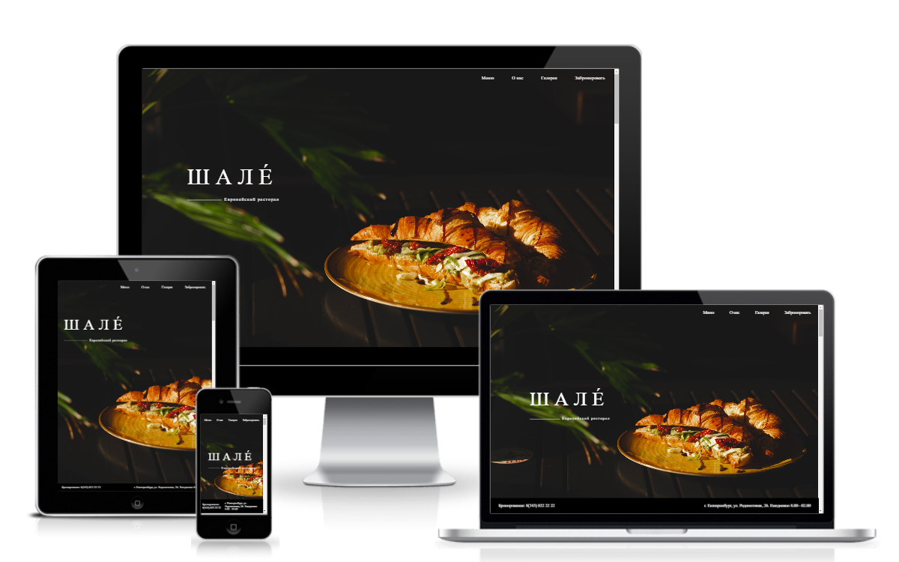

<h1> РЕСТОРАН "ШАЛÉ" </h1>
<a href="https://pstnv-chalet-restaurant.glitch.me/"> https://pstnv-chalet-restaurant.glitch.me </a>

  

 

<h2> О проекте </h2>

 Самостоятельная работа в рамках изучения Figma 

 

<h2> Используемые технологии </h2>

 HTML5 | CSS3 | JavaScript | GSAP

 

<h2>Особенности</h2>
<ul>
  <li> использована анимация для плавного появления элементов </li>
  <li> встроена форма обратной связи Formspree </li>
  <li> сайт адаптирован под мобильные устройства </li>
</ul>
